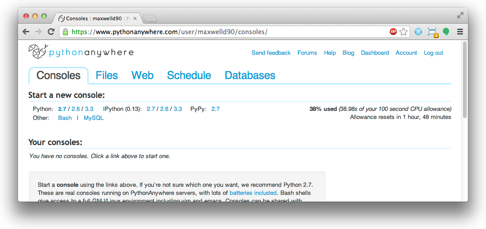

.. _deploy-label:

Deploying Your Project
======================

This chapter provides a step-by-step guide on how to deploy your Django applications. We'll be looking at deploying applications on `PythonAnywhere <https://www.pythonanywhere.com/>`_, an online IDE and web hosting service. The service provides in-browser access to the server-based Python and Bash command line interfaces, meaning you can interact with PythonAnywhere's servers just like you would with a regular terminal instance on your own computer. Although you can pay for PythonAnywhere, a free plan is also offered. The plan sets you up with an adequate amount of storage space and CPU time to get a Django application up and running.

Creating a PythonAnywhere Account
---------------------------------
Before you can do anything, you must first `sign up for a free PythonAnywhere account <https://www.pythonanywhere.com/pricing/>`_. Start with a free account. If your application takes off and becomes popular, you can always enter your credit card details at a later stage and upgrade seamlessly to gain more storage space and CPU time. Too easy!

Once your account has been created, you will have your own little slice of the World Wide Web at ``http://<username>.pythonanywhere.com``, where ``<username>`` is your PythonAnywhere username. It is from this URL that your hosted application will be available from.

The PythonAnywhere Web Interface
--------------------------------
The PythonAnywhere web interface contains a *dashboard* which in turn provides a series of tabs allowing you to manage your application. The tabs as illustrated in Figure :num:`fig-deploy-pythonanywhere` include:

* a *consoles* tab, allowing you to create and interact with Python and Bash console instances;
* a *files* tab, which allows you to upload to and organise files within your disk quota;
* a *web* tab, allowing you to configure settings for your hosted web application;
* a *schedule* tab, allowing you to setup tasks to be executed at particular times; and
* a *databases* tab, which allows you to configure a MySQL instance for your applications should you require it.

Of the the five tabs provided, we'll be working primarily with the *consoles* and *web* tabs. The `PythonAnywhere wiki <https://www.pythonanywhere.com/wiki/>`_ provides a series of detailed explanations on how to use the other tabs.

.. _fig-deploy-pythonanywhere:

	The PythonAnywhere dashboard, showing the *Consoles* tab.

.. _virtual-environment:

Creating a Virtual Environment
------------------------------
As part of a its standard installation, PythonAnywhere comes with a number of packages for you to use. However, since we are using a different setup to the packages provided, we are required to setup a virtual environment to keep our programs separate from the base installation. It's good practice to figure out how to setup virtual environments, anyway!

First, open a Bash console from the PythonAnywhere *Consoles* tab by clicking the *Bash* link. When the terminal is ready for you to interact, enter the following commands.

::
	
	$ source virtualenvwrapper.sh
	$ mkvirtualenv rango

The first command imports the virtual environment wrapper. The wrapper provides a series of extensions by `Doug Hellman <http://doughellmann.com/>`_ to the original ``virtualenv`` tool, making it easier for us to create, delete and use virtual environments. The second command creates a new virtual environment called ``rango``. This process should take a short while to create, after which you will be presented with a slightly different prompt.

::
	
	(rango)16:38 ~ $

Note the inclusion of ``(rango)`` compared to your previous command prompt. This signifies that we have activated the ``rango`` virtual environment, so any package installations will be done within that environment, leaving the wider system setup alone. If you then issue the command ``ls -la``, you will see that a directory called ``.virtualenvs`` has been created. This is the directory in which all of your virtual environments and associated packages will be stored. To confirm the setup, issue the command ``which pip``. This will print the location in which the active ``pip`` binary is located - hopefully within ``.virtualenvs`` and ``rango``, as shown in the example below.

::
	
	/home/<username>/.virtualenvs/test/bin/pip

Now we can customise our virtual environment by installing the required packages for our Rango application. Installing may take a considerable amount of time to install as your CPU time is limited - so have some patience. Issue the following two commands within your console.

::
	
	$ pip install -U django==1.5.4
	$ pip install pil
	
	# TODO (leifos) : add a list of other packages to be installed, or better yet, extract this from the local virtualenv.

After these have executed, check if Django has been installed with the command ``which django-admin.py``. You should receive output similar to the following example. We'll be using this virtual environment to work on the Rango application - whether we're synchronising the database or running population scripts. 

::
	
	/home/<username>/.virtualenvs/rango/bin/django-admin.py

.. note:: PythonAnywhere also provides instructions on how to setup virtual environments for a newer version of Django at https://www.pythonanywhere.com/wiki/VirtualEnvForNewerDjango.

Virtual Environment Switching
.............................
Mastering the ability to switch between your basic Bash terminal and virtual environments is key to improve your productivity. With the extensions provided by ``virtualenvwrapper.sh``, this is an easy task to master.

First, it would be advantageous to add ``source virtualenvwrapper.sh`` to the end of your profile's ``.bashrc`` file, located within the root of your home directory. Doing so will ensure the command is executed automatically for you every time you start a new Bash console instance. Any Bash consoles active will need to be closed for the changes to take effect.

With this done, you can then launch into a preexisting virtual environment with the command

::
	
	workon rango
	
where ``rango`` can be replaced with the name of the virtual environment you wish to use. Your prompt should then change to indicate you are working within a virtual environment. You can then leave the virtual environment using the ``deactivate`` command. Your prompt should then be missing the ``(rango)`` prefix, with an example shown below.

::
	
	16:51 ~ $

Cloning your Git Repository
---------------------------
Now that your virtual environment for Rango is all setup, you can now clone your Git repository to obtain a copy of your project's files. Clone your repository by issuing the following command from your home directory:

``$ git clone https://<USERNAME>:<PASSWORD>@github.com/<OWNER>/<REPO_NAME>.git``

where you replace
	- ``<USERNAME>`` with your GitHub username;
	- ``<PASSWORD>`` with your GitHub password;
	- ``<OWNER>`` with the username of the person who owns the repository; and
	- ``<REPO_NAME>`` with the name of your project's repository.

.. note:: It doesn't matter if you clone your Git repository within your new virtual environment or not. You're only creating files within your disk quota, which doesn't require your special Python setup.

Setting Up the Database
.......................
With your files cloned, you must then prepare your database. We'll be using the ``populate_rango.py`` module that we created earlier in the book. As we'll be running the module, you must ensure that you are using the ``rango`` virtual environment. Ensure that you are in the correct directory containing the root of your project, and issue the following two commands.

::
	
	$ python manage.py syncdb
	$ python populate_rango.py

As discussed earlier in the book, the first command synchronises your database with your project's installed models.

Setting up your Web Application
-------------------------------
Now that your application's files and database are all present and correct, we can set it up to work with PythonAnywhere. Within PythonAnywhere's web interface, navigate to your *dashboard* and click on the *Web* tab. On the left of the page that appears, click *Add a new web app.*

A popup box will then appear. Follow the instructions on-screen, and when the time comes, select the *manual configuration* option. **Don't** select *Django*! You should then complete the wizard.

Once the wizard is complete, navigate to your PythonAnywhere subdomain at ``http://<username>.pythonanywhere.com`` in a new tab - where ``<username>`` is replaced with your PythonAnywhere username. You should be presented with the default ``Hello, World!`` webpage. Awesome! Now let's hook up PythonAnywhere so it runs our Django application instead!

Configuring the WSGI Script
...........................
An abbreviation of `Web Server Gateway Interface <http://en.wikipedia.org/wiki/Web_Server_Gateway_Interface>`_, WSGI provides a simple and universal interface between web servers and your web applications/frameworks written in Python. PythonAnywhere uses WSGI to bridge the server-application link and map incoming requests to your subdomain to your web application.

To configure the WSGI script, navigate to the *Web* tab in PythonAnywhere's dashboard. From there, click the WSGI link located at the top of the page. The link should be preceded with text similar to ``It is configured via a WSGI file stored at:``. The good people at PythonAnywhere have set up a sample WSGI file for us with several possible configurations. For your web application, you'll need to configure the Django section of the file. The example below demonstrates a possible configuration for you application.

.. code-block:: python
	
	# TURN ON THE VIRTUAL ENVIRONMENT FOR YOUR APPLICATION
	activate_this = '/home/<username>/.virtualenvs/rango/bin/activate_this.py'
	execfile(activate_this, dict(__file__=activate_this))

	# +++++++++++ DJANGO +++++++++++
	# To use your own django app use code like this:
	import os
	import sys
	#
	# ADD YOUR PROJECT TO THE PYTHONPATH FOR THE PYTHON INSTANCE
	## assuming your django settings file is at '/home/<username>/mysite/settings.py'
	path = '/home/<username>/tango_with_django/tango_with_django_project'
	
	if path not in sys.path:
	    sys.path.append(path)
	
	# TELL DJANGO WHERE YOUR SETTINGS MODULE IS LOCATED
	os.environ['DJANGO_SETTINGS_MODULE'] = 'tango_with_django_project.settings'
	
	# IMPORT THE DJANGO WSGI HANDLER TO TAKE CARE OF REQUESTS
	import django.core.handlers.wsgi
	application = django.core.handlers.wsgi.WSGIHandler()

Ensure that you replace ``<username>`` with your username, and update any other path settings to suit your application. You should also remove all other code from the WSGI configuration script to ensure no conflicts take place.

The code sample above begins by activating your virtual environment ``rango`` as this has been configured with all the required packages. The script then adds your project's directory to the ``PYTHONPATH`` for the Python instance that runs your web application. This allows Python to access your project's modules. If you have additional paths to add, you can easily insert them here. You can then specify the location of your project's ``settings.py`` module. The final step is to include the Django WSGI handler and invoke it for your application.

When you have completed the WSGI configuration, click the *Save* button at the top-right of the webpage. Navigate back to the *Web* tab within the PythonAnywhere dashboard, and click the *Reload* button at the top of the page. When the application is reloaded, visiting ``http://<username>.pythonanywhere.com`` should present you with your Django application, all ready to go!

.. note:: During testing, we noted that you can sometimes receive ``HTTP 502 - Bad Gateway`` errors instead of your application. To fix this issue, we waited a minute and then reload the application again.

Assigning Static Paths
......................
We're almost there. One issue which we still have to address is to sort out paths for our application. Doing so will allow PythonAnywhere's servers to serve your static content, for example From the PythonAnywhere dashboard, click the *Web* tab and choose the subdomain hosting your application from the list on the left.

Underneath the *Static files* header, perform the following.

#. Click ``Enter URL`` and enter ``/static/admin``, followed by return.
#. Click the corresponding ``Enter path`` text. Set this to ``/home/<username>/.virtualenvs/rango/lib/python2.7/site-packages/django/contrib/admin/static/admin``, where ``<username>`` should be replaced with your PythonAnywhere username. You may also need to change ``rango`` if this is not the name of your application's virtual environment. Remember to hit return to confirm the path.
#. Repeat the two steps above for the URL ``/static/`` and path ``/home/<username>/tango_with_django_project/static``, with the path setting pointing to the ``static`` directory of your web application.

With these changes saved, reload your web application by clicking the *Reload* button at the top of the page. Don't forget about potential ``HTTP 502 - Bad Gateway`` errors!

Turning off ``DEBUG`` Mode
..........................
When you application is ready to go, it's a good idea to instruct Django that your application is now hosted on a production server. To do this, open your project's ``settings.py`` file and change ``DEBUG = True`` to ``DEBUG = False``. This disables `Django's debug mode <https://docs.djangoproject.com/en/1.5/ref/settings/#debug>`_, and removes explicit error messages.

Changing the value of ``DEBUG`` also means you should set the ``ALLOWED_HOSTS`` property. Failing to perform this step will make Django return ``HTTP 400 Bad Request`` errors. Alter ``ALLOWED_HOSTS`` so that it includes your PythonAnywhere subdomain like in the example below.

.. code-block:: python
	
	ALLOWED_HOSTS = ['<username>.pythonanywhere.com>']

Again, ensure ``<username>`` is changed to your PythonAnywhere username. Once complete, save the file and reload the application via the PythonAnywhere web interface.

Log Files
---------
Deploying your web application to another environment introduces another layer of complexity to your setup. Unfortunately, it most likely won't be all plain sailing and will possibly result in new errors or unsuspecting problems. In order for you to diagnose and rectify the issues you may encounter, PythonAnywhere provides you with three log files that can help provide vital clues.

Log files can be viewed via the PythonAnywhere web interface by clicking on the *Web* tab, or by viewing the files in ``/var/log/`` within a Bash console instance. The files provided are:

* ``access.log``, which provides a log of requests made to your subdomain;
* ``error.log``, which logs any error messages produced by your web application; and
* ``server.log``, providing log details for the UNIX processes running your application.

Note that the names for each log file are prepended with your subdomain. For example, ``access.log`` will have the name ``<username.pythonanywhere.com.access.log``. Phew!

When debugging, you may find it useful to delete or move the log files so that you don't have to scroll through a huge list of previous attempts. If the files are moved or deleted, they will be recreated automatically when a new request or error arises.