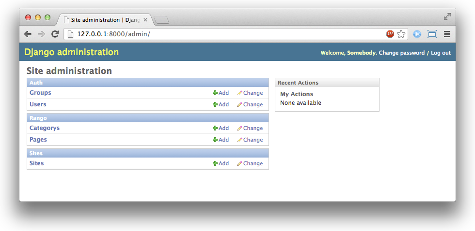
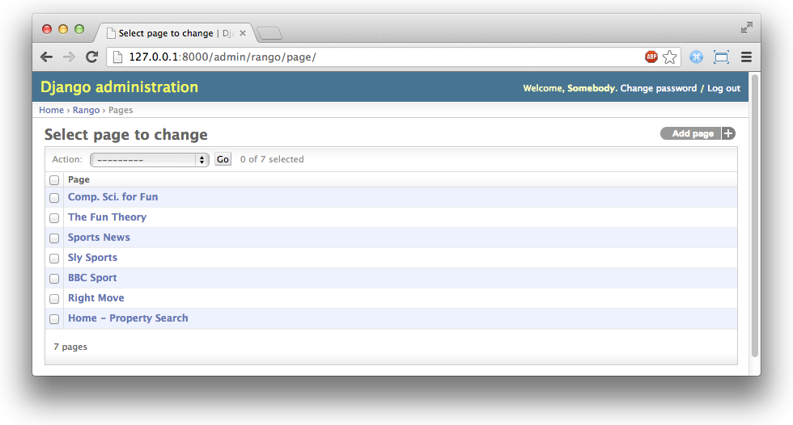

.. _model-label:

Models and Databases
====================
Django provides you with a really simple way to access data for your applications. According to the `Django documentation <https://docs.djangoproject.com/en/1.5/topics/db/models/>`_, *models* are the *definitive source of data about your data*. If you don't like SQL that much, you're going to love this. Read on to learn how to create your own models, save them to a database of your choice, and use them in your project.

Rango's Requirements
--------------------
As part of this chapter, we'll be focusing on setting everything up for our sample Django application, Rango. So that you know exactly what we are developing, let's assume that we have the following requirements for our new application.

* Rango is a *web page directory* - a site containing links to other websites. A simplified version of what we wish to achieve can be seen at `this <http://www.w3.org/History/19921103-hypertext/hypertext/DataSources/WWW/Servers.html>`_ archived webpage - created by `Sir Tim Berners-Lee <http://www.w3.org/People/Berners-Lee/>`_ - from 1992.
* Rango splits the links it stores up into different *webpage categories*. For example, we might have a section on sport, and a section on politics.
* Therefore, each category houses a list of links to webpages (e.g. a one-to-many relationship).
* The index page of Rango (or homepage) will display a list of categories to the user.
* A user of the application will be able to select a category, and Rango will then display the list of links/pages to webpages for that particular category.
* Each category has its own name.
* Each page refers to a category and has a title, URL and an integer to record the number of times the page has been viewed.

These points should make the requirements of what we wish to build much clearer.

Telling Django About Your Database
----------------------------------
Now that we know roughly what we want to create, we can get started. Before we can create any models, we must first setup our database for use by Django. This again involves modifying our project's ``settings.py``, located within the project configuration directory (e.g. ``<workspace>/tango_with_django_project/tango_with_django_project/``). Within the file, locate the ``DATABASES`` dictionary. Modify the ``default`` key/value pair so it looks something like the following example.

.. code-block:: python
	
	DATABASES = {
	    'default': {
	        'ENGINE': 'django.db.backends.sqlite3',
	        'NAME': PROJECT_PATH + '/tango_with_django_project/rango.db',
	    }
	}

With the example above, we define the *default* database to use the *SQLite* Django backend. This provides us with access to the lightweight database framework, `SQLite <http://www.sqlite.org/>`_. When using SQLite as the database engine, the ``NAME`` key/value pair specifies the path to the database file. In the example above, we make use of our ``PROJECT_PATH`` variable defined in the previous chapter to produce an absolute path to where we wish to store our database. In the example, the value for ``NAME`` would be ``<workspace>/tango_with_django_project/tango_with_django_project/rango.db``. For SQLite databases, the remaining keys of ``USER``, ``PASSWORD``, ``HOST`` and ``PORT`` are not required - you can remove them if you wish.

.. note:: With Django, you aren't restricted to using only SQLite as your database engine. Django itself comes with out of the box support for several other popular database engines - all of which are listed as part of `Django's official documentation <https://docs.djangoproject.com/en/1.5/ref/settings/#std:setting-DATABASE-ENGINE>`_. Database engines such as `PostgreSQL <http://www.postgresql.org/>`_ and `MySQL <http://www.mysql.com/>`_ are much more robust and capable of servicing large volumes of requests, so you can consider them if you are developing a project that will be visited frequently. For a simple introductory project however, SQLite should more more than sufficient for your needs. You can also use multiple databases if you need to. Check out `Django's official documentation <https://docs.djangoproject.com/en/1.5/topics/db/multi-db/>`_ for more information in this area.

Creating Models
---------------
With your database configured in ``settings.py``, let's now create two initial data models for the Rango application. To start, navigate to the ``rango`` directory, contained within your Django project's root directory. Within ``rango``, open the file ``models.py``. This file provides a location for you to define all of Rango's database models.

Within ``models.py``, we then need to create two Python classes, both of which inherit from ``django.db.models.Model``. The two Python classes will be the definitions for models representing categories and pages, each of which are explained in the requirements section above. The code for the two models should look like the following example. Note that you should keep the ``import`` statement provided at the top of the file for you - if you delete it, your models won't work!

.. code-block:: python
	
	class Category(models.Model):
	    name = models.CharField(max_length=128, unique=True)
	    
	    def __unicode__(self):
	        return self.name
	
	class Page(models.Model):
	    category = models.ForeignKey(Category)
	    title = models.CharField(max_length=128)
	    url = models.URLField()
	    views = models.IntegerField()
	    
	    def __unicode__(self):
	        return self.title

From the code example above, defining a model is essentially a process of creating a class and defining a series of attributes for each field of your database model. In an attempt to make this concept easier to understand, Figure :num:`fig-relational-schema-basic-models` shows a relational schema representing the two models defined above.

.. _fig-relational-schema-basic-models:

.. figure:: ../images/relational-schema-basic-models.pdf
	:figclass: align-center

	A relational schema diagram which shows the two database tables created as a result of the Django models defined previously.

You can imagine that each attribute you create in a Django model corresponds to a column in a database table. The column type depends on the kind of field you specify. Django provides many kinds of built-in fields that you can use in your databases - some with optional parameters, others without. Check out the `Django documentation <https://docs.djangoproject.com/en/1.5/ref/models/fields/>`_ for a full list of built-in field types. Some of the most common types you will use are listed below.

* ``CharField``, a field for storing character data (e.g. strings). Speciy ``max_length`` to provide a maximum number of characters the field can store.
* ``URLField``, much like a ``CharField``, but designed for storing resource URLs. You may also specify a ``max_length`` parameter.
* ``IntegerField``, which stores integers.
* ``DateField``, which stores a Python ``datetime.date``.

For each field, you can specify the ``unique`` attribute. If set to ``True``, only one instance of a particular value in that field may exist throughout the entire database model. For example, take a look at our ``Category`` model defined above. The field ``name`` has been set to unique - thus every category name must be unique.

This is useful if you wish to use a particular field as an additional database key. You can also specify additional attributes for each field, such as specifying a default value (``default='value'``) and whether the value for a field can be ``NULL`` (``null=True``) or not. 

Django also provides simple mechanisms that allows us to relate models/database tables together. These mechanisms are encapsulated in three further field types, and are listed below.

* ``ForeignKey``, a field type that allows us to create a one-to-many relationship.
* ``OneToOneField``, a field type that allows us to define a strict one-to-one relationship.
* ``ManyToManyField``, a field type which allows us to define a many-to-many relationship.

From our model examples above, the field ``category`` in model ``Page`` is of type ``ForeignKey``. This allows us to create a one-to-many relationship with model/table ``Category``, which is specified as an argument to the field's constructor. **You should be aware that Django creates an ID field for you automatically in each table relating to a model. You therefore do not need to explicitly define a primary key for each model.** Django makes your life so much easier!

.. note:: When creating a Django model, it's good practice to make sure you include the ``__unicode__()`` method - a method almost identical to the ``__str__()`` method. If you're unfamiliar with both of these, think of them as methods analogous to the ``toString()`` method in a Java class. The method is used to provide a unicode representation of a model instance. Our ``Category`` model for example returns the name of the category in the ``__unicode__()`` method - something which will be incredibly handy to you when you begin to use the Django admin interface later on in this tutorial.

Creating and Synchronising the Database
---------------------------------------
With our models defined, we can now let Django work its magic and create the table representations in our database. With a terminal or Command Prompt instance looking at your Django project's root, synchronise the database with the ``manage.py`` script.

``$ python manage.py syncdb``

Follow the on-screen instructions. You'll notice that Django creates a number of tables within your specified database. Of particular interest to you are the two tables ``rango_category`` and ``rango_page``. These correspond to your two Rango models, ``Category`` and ``Page``. Check out the example output the script produces below.

::
	
	$ python manage.py syncdb
	
	Creating tables ...
	Creating table auth_permission
	Creating table auth_group_permissions
	Creating table auth_group
	Creating table auth_user_groups
	Creating table auth_user_user_permissions
	Creating table auth_user
	Creating table django_content_type
	Creating table django_session
	Creating table django_site
	Creating table rango_category <-- Rango Category model
	Creating table rango_page     <-- Rango Page model

	You just installed Django's auth system, which means you don't have any superusers defined.
	Would you like to create one now? (yes/no): yes
	Username (leave blank to use '<YOUR USERNAME>'): <ENTER A USERNAME>
	Email address: <ENTER YOUR E-MAIL ADDRESS>
	Password: <ENTER PASSWORD>
	Password (again): <ENTER PASSWORD AGAIN>
	Superuser created successfully.
	Installing custom SQL ...
	Installing indexes ...
	Installed 0 object(s) from 0 fixture(s)

You may be asked if you wish to create a superuser account, like in the example above. The superuser account will be used to access the Django admin interface later on in this tutorial, so we recommend that you bite the bullet and set up an account now. Enter ``yes``, then enter a username for the account, your e-mail address and provide a password when prompted. Once completed, the script should finish successfully. Make sure you take a note of the username and password for your superuser account.

Have a look at your project configuration directory (e.g. the nested ``tango_with_django_project`` directory). You should now have a new file present called ``rango.db`` if you are using SQLite and followed our instructions. This file is your database, and if you wish to delete it, you'll have to go through the ``syncdb`` process once more.

Although we know that the ``manage.py`` script created a load of tables in our database for us, what you don't see is the interactions going on between Django and the database backend. If you're interested, run the command ``python manage.py sql rango``. This will output the SQL code that was issued to the database backend on your behalf. The code that was executed for us is shown below. Pay particular attention to the foreign key reference that is created in table ``rango_page``, and the ``id`` fields created in both tables.

.. code-block:: sql
	
	BEGIN;
	CREATE TABLE "rango_category" (
	    "id" integer NOT NULL PRIMARY KEY,
	    "name" varchar(128) NOT NULL UNIQUE
	)
	;
	CREATE TABLE "rango_page" (
	    "id" integer NOT NULL PRIMARY KEY,
	    "category_id" integer NOT NULL REFERENCES "rango_category" ("id"),
	    "title" varchar(128) NOT NULL,
	    "url" varchar(200) NOT NULL,
	    "views" integer NOT NULL
	)
	;

	COMMIT;

Thank you, Django! Hopefully now you can see that much of the donkeywork regarding databases is nicely abstracted away from us. With the Django models framework, we simply don't have to worry about what SQL commands to issue, although we `can run custom SQL <https://docs.djangoproject.com/en/1.5/topics/db/sql/#executing-custom-sql-directly>`_ if the need arises.

.. warning:: The process of synchronising your database is what you should do when you create new models for your Django applications. For example, we could create a new model for Rango and then run the ``manage.py syncdb`` command again to update our database. Problems arise however if you wish to *update* a previously synchronised model. If you were to add an additional field, you would have to recreate your database - **syncdb doesn't pick up on these changes.** It's disappointing that no built-in functionality presently exists within Django to handle this scenario. However, there are external libraries which can add such functionality. Check out `this <http://stackoverflow.com/questions/830130/adding-a-field-to-an-existing-django-model>`_ Stack Overflow question and answer page for more details. One of the answers recommends using `South <http://south.aeracode.org/>`_, which works really well. However, we don't discuss South in this tutorial. Have a look at the `official South tutorial <http://south.readthedocs.org/en/latest/tutorial/index.html>`_ if you'd like to learn more.

Django Models and the Django Shell
----------------------------------
Before we turn our attention to demonstrating the Django admin interface, it's worth noting that you can interact with Django models from the Django shell - a very useful aid for debugging purposes. We'll demonstrate how to create a ``Category`` instance using this method.

To access the shell, we need to call ``manage.py`` from within your Django project's root directory once more. Run the command

``$ python manage.py shell``

which will start an instance of the Python interpreter. In this case, Django sets up your path and imports your project's settings for you. Doing so will ensure that everything will work correctly. When the interpreter is started, enter the following code. At the end of each line, hit return or enter on your keyboard to execute the line. Read the comments added inline with the code for an explanation of what is going on.

.. code-block:: python
	
	# Import the Category model from the Rango application
	>>> from rango.models import Category
	
	# Show all the current categories
	>>> print Category.objects.all()
	[] # Returns an empty list (no categories have been defined!)
	
	# Create a new category object, and save it to the database.
	>>> c = Category(name="Test")
	>>> c.save()
	
	# Now list all the category objects stored once more.
	>>> print Category.objects.all()
	[<Category: test>] # We now have a category called 'test' saved in the database!
	
	# Quit the Django shell.
	>>> quit()

With only a few lines of Python, we can create a model instance (or database table row) and save it to the database. All without a single line of SQL.

.. note:: The example we provide above is only a very basic taster on database-related activities you can perform in the Django shell. Check out the `online documentation <https://docs.djangoproject.com/en/1.5/ref/django-admin/#available-commands>`_ for a comprehensive list of commands you can issue to modify your database - and perform other Django-related tasks.

Configuring the Admin Interface
-------------------------------
One of the many awesome features of Django is that it provides a built-in, web-based administrative interface that allows us to browse and edit data stored within our models/database tables. Before we can use this functionality, we need to configure it for use.

First, we must open our Django project's ``settings.py`` file. This is located within the project configuration directory. Within the file, locate the ``INSTALLED_APPS`` tuple, and uncomment the line which adds ``django.contrib.admin``. The tuple should now look something like:

.. code-block:: python
	
	INSTALLED_APPS = (
	    'django.contrib.auth',
	    'django.contrib.contenttypes',
	    'django.contrib.sessions',
	    'django.contrib.sites',
	    'django.contrib.messages',
	    'django.contrib.staticfiles',
	    # Uncomment the next line to enable the admin:
	    'django.contrib.admin', # THIS LINE SHOULD NOW BE UNCOMMENTED
	    # Uncomment the next line to enable admin documentation:
	    # 'django.contrib.admindocs',
		'rango',
	)

When this has been done, save the file and synchronise the database. We need to do this as the ``django.contrib.admin`` application needs to add some database tables in order to function correctly. Run the command

``$ python manage.py syncdb``

from within your Django project's root. You should see that the table ``django_admin_log`` is created for you. Once done, you must open your project's root ``urls.py`` file. This was created in the project configuration directory. Within the file, we first need to uncomment the two lines after the import statements. We also need to ensure that the URL pattern for ``/admin/`` is present, and points to the ``admin.site.urls`` module. Have a look at the code sample below to see our modified file.

.. code-block:: python
	
	from django.conf.urls import patterns, include, url
	from django.conf import settings

	# Uncomment the next two lines to enable the admin:
	from django.contrib import admin # UNCOMMENT THIS LINE
	admin.autodiscover() # UNCOMMENT THIS LINE, TOO!

	urlpatterns = patterns('',
		url(r'^rango/', include('rango.urls')),
		url(r'^admin/', include(admin.site.urls)), # ADD THIS LINE
		)

	if settings.DEBUG:
		urlpatterns += patterns(
			'django.views.static',
			(r'media/(?P<path>.*)',
			'serve',
			{'document_root': settings.MEDIA_ROOT}), )

Save the ``urls.py`` file. We're almost there! We need to now tell the Django admin application what models we wish to make available to the admin interface. To do this, start by navigating to the ``rango`` application directory. Within the directory, create a new file called ``admin.py``. Add the following code to the file:

.. code-block:: python
	
	from django.contrib import admin
	from rango.models import Category, Page

	admin.site.register(Category)
	admin.site.register(Page)
	
Save the file. Essentially, we need to *regsiter* each of the two models we created earlier with the admin interface. Doing so makes the admin application aware of them. If we were to have another model, it would be a trivial case of calling the ``admin.site.register()`` function, passing the model in as a parameter.

With all of these changes made, start or restart the Django development server as you normally do. Navigate to the URL ``http://127.0.0.1:8000/admin/``, substituting the port and address to those of your particular setup. You should then see a login box, prompting you for a username and password. Enter the username and password you created when setting up your database, and you should then see a webpage similar to that shown in Figure :num:`fig-rango-admin`. If you do, you've successfully set up the Django admin interface!

.. _fig-rango-admin:

	The Django admin interface. Note the Rango category, and the two models contained within.

Try clicking the ``Categorys`` link within the ``Rango`` section. From here, you should see the ``test`` category that we created via the Django shell. Try deleting the category - we will be populating the database with a population script next. The interface is easy to use. Spend a few minutes creating, modifying and deleting both categories and pages. You can also add new users who can login to the Django admin interface for your project by adding a user to the ``User`` in the ``Auth`` application.

.. note:: Note the typo within the admin interface (categorys, not categories). This problem can be fixed by adding a nested ``Meta`` class into your model definitions with the ``verbose_name_plural`` attribute. Check out the `official Django documentation <https://docs.djangoproject.com/en/1.5/topics/db/models/#meta-options>`_ for more information.

.. note:: The example ``admin.py`` file for our Rango application is the most simple, functional example available. There are many different features which you can use in the ``admin.py`` to perform all sorts of cool customisations, such as changing the way models appear in the admin interface. For this tutorial, we'll stick with the bare-bones admin interface, but you can check out the `official Django documentation <https://docs.djangoproject.com/en/1.5/ref/contrib/admin/>`_ for more information.

Creating a Population Script
----------------------------
It's highly likely that during the course of development, you'll come to a point where you will need to modify a model/table. When you do this, the easiest option - without external software - is to re-create your entire database and run ``python manage.py syncdb`` ...again! Since this slow and repetitive task can be such a pain, it's good practice to create what we call a *population script* for your database. Such a script is designed to automatically populate your database with test data for you, potentially saving you lots of time.

To create a population script for Rango's database, we start by creating a new Python module within our Django project's root directory (e.g. ``<workspace/tango_with_django_project/``). Create ``populate_rango.py`` and add the following code.

.. code-block:: python
	
	import os
	import sys
	
	def populate():
	    home_cat = add_cat('Python')
	
	    add_page(cat=home_cat,
	        title="Official Python Tutorial",
	        url="http://docs.python.org/2/tutorial/")
	
	    add_page(cat=home_cat,
	        title="How to Think like a Computer Scientist",
	        url="http://www.greenteapress.com/thinkpython/")
	
	    add_page(cat=home_cat,
	        title="Learn Python in 10 Minutes",
	        url="http://www.korokithakis.net/tutorials/python/")
	
	    sport_cat = add_cat("Django")
	
	    add_page(cat=sport_cat,
	        title="Official Django Tutorial",
	        url="https://docs.djangoproject.com/en/1.5/intro/tutorial01/")
	
	    add_page(cat=sport_cat,
	        title="Django Rocks",
	        url="http://www.djangorocks.com/")
	    
	    add_page(cat=sport_cat,
	        title="How to Tango with Django",
	        url="http://www.tangowithdjango.com/")
	
	    fun_cat = add_cat("Other Frameworks")
	
	    add_page(cat=fun_cat,
	        title="Ruby on Rails",
	        url="http://rubyonrails.org/")
	
	    add_page(cat=fun_cat,
	        title=".NET MVC",
	        url="http://www.asp.net/mvc")
	
	    # Print out what we have added to the user.
	    for c in Category.objects.all():
	        for p in Page.objects.filter(category=c):
	            print "- {0} - {1}".format(str(c), str(p))
	
	def add_page(cat, title, url, views=0):
	    p = Page.objects.get_or_create(category=cat, title=title, url=url, views=views)[0]
	    return p
	
	def add_cat(name):
	    c = Category.objects.get_or_create(name=name)[0]
	    return c
	
	# Start execution here!
	if __name__ == '__main__':
	    print "Starting Rango population script..."
	    os.environ.setdefault('DJANGO_SETTINGS_MODULE', 'tango_with_django_project.settings')
	    from rango.models import Category, Page
	    populate()

While this looks like a lot of code, what it does is relatively simple. As we define a series of functions at the top of the file, code execution begins towards the bottom - look for the line ``if __name__ == '__main__'``. We then import Rango's settings and our models ``Category`` and ``Page`` and call the ``populate()`` function.

.. warning:: When importing Django models, make sure you have imported your project's settings by that stage. If you don't, an exception will be raised. This is why we import ``Category`` and ``Page`` towards the end of the population script, rather than at the top.

The ``populate()`` function is responsible for the calling the ``add_cat()`` and ``add_page()`` functions, who are in turn responsible for the creation of new categories and pages respectively. ``populate()`` keeps tabs on category references for us as we create each individual ``Page`` model instance and store them within our database. Finally, we loop through our ``Category`` and ``Page`` models to print to the user all the ``Page`` instances and their corresponding categories.

.. note:: We make use of the convenience ``get_or_create()`` function for creating model instances. Check out the `official Django documentation <https://docs.djangoproject.com/en/1.5/ref/models/querysets/#get-or-create>`_ for more information on this function. The documentation will explain why we pass index ``[0]`` of the function's returned value!

When saved, we can run the script by changing the current working directory in a terminal to our Django project's root and executing the module with the command ``$ python populate_rango.py``. You should then see output similar to that shown below.

::
	
	$ python populate_rango.py
	Starting Rango population script...
	- Python - Official Python Tutorial
	- Python - How to Think like a Computer Scientist
	- Python - Learn Python in 10 Minutes
	- Django - Official Django Tutorial
	- Django - Django Rocks
	- Django - How to Tango with Django
	- Other Frameworks - Ruby on Rails
	- Other Frameworks - .NET MVC

Now let's verify that the population script populated the database. Restart the Django development server, navigate to the admin interface, and check that you have some new categories and pages. Do you see all the pages if you click ``Pages``, like in Figure :num:`fig-admin-populated`?

.. _fig-admin-populated:

	The Django admin interface, showing the Page table populated with sample data from our population script.

A population script is a really simple way to regenerate test data for your database. Get yourself into a habit of calling your population script every time you need to recreate your database - and don't forget to update the script if your database models change!

Basic Workflow
--------------
Getting to grips with Django's model-view-controller architecture can be a bit of a head-scratcher. This can be especially true for those of you who have previously undertaken web development tasks, where you might be well-versed with using SQL to query your databases. However, time and practice will turn you into a pro.

Let's now summarise the basic workflow of adding a new model. Remember that with a new Django project, you should first tell Django about the database you intend to use. Without doing so, Django won't have anywhere to store your data. You can also enable the admin interface to make your life a little bit easier - and remember, you can always disable it later if you want to.

Once these steps are completed, the workflow for adding models can be broken down into five steps.

#. First, create your new model(s) in your Django application's ``models.py`` file.
#. With the model created, reconfigure the admin interface to include your new model(s), if you are using it.
#. You should then synchronise or resynchronise your database with the ``$ python manage.py syncdb`` command. This will create the necessary infrastructure within the database for your new model(s).
#. Create and run a population script for your new model(s) for an easy way to add test data.
#. Verify that test data has been correctly added to the model(s) by exploring the admin interface.

You should also remember about the nuances of the ``syncdb`` command. Note that the command can be used only for adding new models to your database - if you wish to amend an existing model, you must recreate the database. This is unfortunately a very frustrating thing to have to do. However, there is a `Python package called South <http://south.readthedocs.org/en/latest/about.html>`_ which handles this case for you - although we do not discuss South in this book.

Exercises (LEIF TODO?)
---------------------

* Customize the Admin Interface - so that for the Pages table the list view also displays the category name and the category url name (i.e. the encoded category name).
