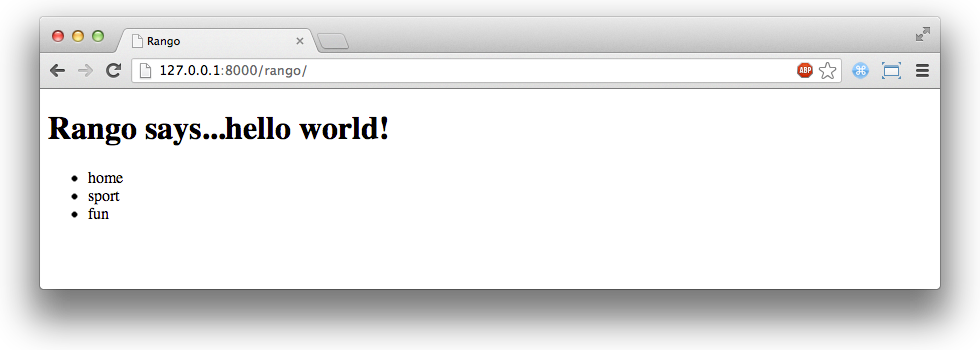

.. _model-using-label:

Models and Templates
====================
Now that we have our models set up and populated with some sample data, now would be a good time to have a look at how you can incorporate data from your models into templates. We'll be looking to see how we can get started with *dynamic templates*.

Basic Workflow
..............
Essentially, making a dynamic template consists of the following four steps. We'll be looking at each of these steps in more detail further on in this section.

#. First, import the models you wish to use into your application's ``views.py`` file.
#. Within the view you wish to use, query the model to get the data you want to present.
#. Pass the results from your model into the template's context.
#. Setup your template to present the data to the user in whatever way you wish.

These steps highlight the awesome separation of concerns you get with using Django's framework - especially the separation of presentation from querying.

Showing Categories on the Homepage
..................................
In keeping with Rango's requirements that we defined at the start of this chapter, we'll be looking at modifying the Rango application's homepage to dynamically include all the categories stored within the database. We'll be doing this using the four steps we defined above.

Let's get started. Open Rango's ``views.py`` file, located within the ``rango`` application directory. Add an import statement to the top of the file such that we import the ``Category`` model from Rango's ``models.py`` file.

.. code-block:: python
	
	# Import the Category model
	from rango.models import Category

With the first step out of the way, we then want to modify our ``index()`` function. If we cast our minds back, we should remember the ``index()`` function is responsible for the homepage view. Modify the function to look like the sample code below.

.. code-block:: python
	
	def index(request):
	    # Obtain the context from the HTTP request.
	    context = RequestContext(request)
	    
	    # Query the database for a list of ALL categories currently stored.
	    # Place the list in our context_dict dictionary which will be passed to the template engine.
	    category_list = Category.objects.all()
	    context_dict = {'categories': category_list}
	    
	    # Render the response and send it back!
	    return render_to_response('rango/index.html', context_dict, context)

We perform steps two and three in one go here: first we query the ``Category`` model (notice the similarity in code from the Django shell?). The query is simple - we are returned every category within the database. Each returned category is an instance of the ``Category`` class/model. These are stored within a Python list, demonstrated with the example taken from the Django shell below.

.. code-block:: python
	
	>>> Category.objects.all()
	[<Category: home>, <Category: sport>, <Category: fun>]

With the query complete, we pass a reference to the list (stored as variable ``category_list``) to a new dictionary, ``context_dict``. This dictionary is then passed as part of the context for the template engine.

With the view updated, all that is left for us to do is update the template ``rango/index.html``, located within the ``templates`` directory. Remember, the ``templates`` directory itself can found in your Django project's root. Change the HTML code of the file to the example shown below.

.. code-block:: html
	
	<!DOCTYPE html>
	<html>
	    <head>
	        <title>Rango</title>
	    </head>
	
	    <body>
	        <h1>Rango says...hello world!</h1>
	
	        
	            <ul>
	                
	                <li>{{ category.name }}</li>
	                
	            </ul>
	        
	            <strong>No categories at present.</strong>
	        
	
	    </body>
	</html>

Here, we make extensive use of Django's template language. This is how we instruct Django how the page should be constructed. Within the ``<body>`` of the page, we test to see if ``categories`` - the name of the context variable containing our list - contains any categories. If so, we proceed to construct an unordered HTML list (within the ``<ul>`` tags). Note the syntax similarities of Django's template language and that of Python. You should also note that all commands are enclosed within the tags ````, while variables are referenced within ``{{`` and ``}}`` brackets. In the example above, ``{{ category.name }}`` refers to a category's name attribute. The for loop then iterates through the list of results, printing out each category's name within a pair of ``<li>`` tags to indicate a list element. If no categories exist, a message is displayed instead indicating so.

When you complete this, save the template and start the Django development server if you haven't already done so. Navigate to Rango's homepage. You should see a list of three categories underneath the page title just like in Figure :num:`fig-rango-categories-simple`. If you do, you've got your first dynamically generated Django page working!

.. _fig-rango-categories-simple:

	The Rango homepage - now dynamically generated - showing a list of categories.

.. note:: If you're interested in learning more about the extensive functionality offered by Django's template language, check out the official `Django documentation <https://docs.djangoproject.com/en/1.5/topics/templates/>`_ for more information. We'll be using it more as we progress through the tutorial.

Creating a Details Page
.......................
According to Rango's specification, we need to show a list of pages that are associated with each category. In order for us to accomplish this, we need to start by thinking of how to design Rango's URLs and URL patterns to handle this requirement in a graceful manner.

One way with which we could tackle this problem is to use the unique ID for each category within the URL. For example, we could create URLs like ``/rango/category/1/`` or ``/rango/category/2/``, where the numbers correspond to the categories with unique IDs 1 and 2 respectively. However, these URLs are hardly human readable. Although we could probably infer that the number relates to a category, how would a user know what category relates to unique IDs 1 or 2? The user wouldn't know without trying. Instead, we could just use the category name as part of the URL. ``/rango/category/sport/`` should give us a list of pages related to the sport category. An even simpler approach would be to remove ``category`` altogether, leaving URLs such as ``/rango/fun/`` or ``/rango/sport/``. These URLs are nice from a usability point of view because the URLs are readable, meaningful and predictable.

.. note:: Designing URLs is seemingly like an art. The key tip is to leave as little information in the URL as required. Simple is best. Check out `this discussion <http://en.wikipedia.org/wiki/Clean_URL>`_ on Wikipedia for some good information on designing *clean URLs*.

With our URLs chosen, let's get started with a category page. To get everything working, we'll need to do the following.

#. Create a new view in ``rango/views.py`` - called ``category`` - with associated helper functions. The ``category`` view will take an additional parameter, ``category_name_url``.
#. Create a new template, ``templates/rango/category.html``.
#. Update Rango's ``urlpatterns`` to map the new ``category`` view to a URL pattern in ``rango/urls.py``.

We'll also look at updating our existing homepage (the ``index`` view) view to provide links to the new category view.

First, let's add our new view, ``category``. Open the ``views.py`` in the ``rango`` application directory and add the following code.

.. code-block:: python
	
	def category(request, category_name_url):
	    # Request our context from the request passed to us.
	    context = RequestContext(request)
	    
	    # Change underscores in the category name to spaces.
	    # URLs don't handle spaces well, so we encode them as underscores.
	    # We can then simply replace the underscores with spaces again to get the name.
	    category_name = category_name_url.replace('_', ' ')
	    
	    # Build up the dictionary we will use as our template context dictionary.
	    context_dict = {'category_name': category_name}
	    
	    try:
	        # Can we find a category with the given name?
	        # If we can't, the .get() method raises a DoesNotExist exception.
	        # So the .get() method returns one model instance or raises an exception.
	        category_model = Category.objects.get(name=category_name)
	        
	        # Retrieve all of the associated pages.
	        # Note that filter returns >= 1 model instance.
	        pages = Page.objects.filter(category=category_model)
	        
	        # Adds our results list to the template context under name pages.
	        context_dict['pages'] = pages
	    except Category.DoesNotExist:
	        # We get here if we didn't find the specified category.
	        # Don't do anything - the template displays the "no category" message for us.
	        pass
	    
	    # Go render the response and return it to the client.
	    return render_to_response('rango/category.html', context_dict, context)

Our new view follows the same basic steps as our simple homepage view. We obtain the context of the request, build a context dictionary, render the template, and send the result back. The difference here is that the context dictionary building is a little more complex - we need to check the database for the category we supply as argument ``category_name_url``, and build the context dictionary depending on the result we get. Check out the commentary in the code for a more detailed explanation of what each line achieves.

.. warning:: You may have seen in the ``category()`` view function above that we take the category passed to us, and replace underscores with spaces. This is because URLs don't handle spaces well. While you can use them, it's a bad design choice because they are `considered to be unsafe <http://stackoverflow.com/a/497972>`_. To counter this, we can *encode* the URL such that spaces are changed to underscores. To *decode*, we simply swap back. As you'll see when we modify the ``index()`` category later, we will perform encoding which is passed to the new ``category()`` view via an HTML hyperlink.

We'll also need to import the ``Page`` model into ``views.py``, since we now make use of it in our new view. Add the following import statement at the top of the file.

.. code-block:: python
	
	from rango.models import Page

Now let's create our template for the new view. As you can see from the code above, we call the view ``category.html``. Within your ``<workspace>/tango_with_django_project/templates/rango/`` directory, create the new HTML file. In the file, add the following code:

.. code-block:: html
	
	<!DOCTYPE html>
	<html>
	    <head>
	        <title>Rango</title>
	    </head>
	
	    <body>
	        <h1>{{ category_name }}</h1>
	
	        
	        <ul>
	            
	            <li><a href="{{ page.url }}">{{ page.title }}</a></li>
	            
	        </ul>
	        
	            <strong>No pages currently in category.</strong>
	        
	    </body>
	</html>

The HTML code example again demonstrates how we utilise the data passed to the template via its context. We make use of ``category_name``, and our ``pages`` list. If ``pages`` is undefined, or contains no elements, we display a message stating there are no pages present. Otherwise, the pages within the category are presented in a HTML list. For each page in the ``pages`` list, we make use of their ``title`` and ``url`` attributes.

Now let's have a look at how we actually pass the value of the ``category_name_url`` parameter to the ``category()`` function. To do so, we need to modify Rango's ``urls.py`` file. Open the file, and add a new pattern to the tuple. The tuple should then look like:

.. code-block:: python
	
	urlpatterns = patterns('',
	    url(r'^$', views.index, name='index'),
	    url(r'^(?P<category_name_url>\w+)$', views.category, name='category'),) # New!

Check out the regular expression for the second ``urlpattern`` tuple entry, which passes to ``views.category()``. We set up our regular expression to look for any sequence of word characters (e.g. a-z, A-Z, _, or 0-9) before the end of the URL, or a trailing URL slash - whatever comes first. This value is then passed to the view ``views.category()`` as parameter ``category_name_url``, the only argument after the mandatory ``request`` argument. Essentially, the name you hard-code into the regular expression is the name of the argument that Django looks for in your view's function definition.

.. note:: Regular expressions may seem horrible and confusing at first, but there are tons of resources online to help you. `This cheat sheet <http://cheatography.com/davechild/cheat-sheets/regular-expressions/>`_ provides you with an excellent resource for fixing pesky regular expression problems.

Our new view is set up and ready to go - but we need to do one more thing. Our homepage view (or ``index()``) needs to be updated to provide users with a means to view category pages that are listed. To do this, we first need to modify the ``index()`` view. Open up Rango's ``views.py`` file if you haven't already got it open, and change the code to the following example. Check out the inline commentary to see what has been added.

.. code-block:: python
	
	def index(request):
	    # Obtain the context from the HTTP request.
	    context = RequestContext(request)
	    
	    # Query for categories - add the list to our context dictionary.
	    category_list = Category.objects.all()
	    context_dict = {'categories': category_list}
	    
	    # The following two lines are new.
	    # We loop through each category returned, and create a URL attribute.
	    # This attribute stores an encoded URL (e.g. spaces replaced with underscores).
	    for category in category_list:
	        category.url = category.name.replace(' ', '_')
	    
	    # Render the response and return to the client.
	    return render_to_response('rango/index.html', context_dict, context)

As shown in the commentary, we take each category that the database returns us, and encode the name to make it URL friendly. This URL friendly value is then placed as an attribute inside the category object. This doesn't affect the database; we do not call the ``save()`` method on the object. It's only a temporary measure which is passed to the template engine to be rendered.

We then pass our list of categories - ``category_list`` - to the context of the template so it can be rendered. With a ``url`` attribute now available for each category, we can update our ``index.html`` template to look like this:

.. code-block:: html
	
	<!DOCTYPE html>
	<html>
	    <head>
	        <title>Rango</title>
	    </head>

	    <body>
	        <h1>Rango says..hello world!</h1>

	        
	            <ul>
	                
	                <!-- Following line changed to add an HTML hyperlink -->
	                <li><a href="/rango/{{ category.url }}">{{ category.name }}</a></li>
	                
	            </ul>
	       
	            <strong>No categories at present.</strong>
	       

	    </body>
	</html>

For each list element (``<li>``), we add an HTML hyperlink (``<a>``). The hyperlink has an ``href`` attribute, which we use to specify the link *target* URL. In this example, if the ``href`` were set to ``/rango/sports/``, the user would be directed to ``/rango/sports/`` if he or she clicked the link. The clickable link text the user sees on the page is contained within the opening and closing tags (e.g. ``<a>TEXT</a>``). In our example above, the text displayed is the name of the category - or ``{{ category.name }}``.

.. _fig-rango-links:

.. figure:: ../images/rango-links.pdf
	:figclass: align-center

	What your link structure should now look like. Starting with the Rango homepage, you are then presented with the category detail page. Clicking on a page link takes you to the linked website.
	
With these changes now saved, we should be ready to try out our new view! Fire up your Django development server, and navigate to Rango's homepage. You should see your homepage listing all the categories. The categories should now be clickable links. Clicking on ``sport`` should then take you to the ``sport`` detailed category view, as demonstrated in Figure :num:`fig-rango-links`. If you see a list of links like ``BBC Sport``, you've successfully set up a new view. Try navigating a category which doesn't exist, like ``/rango/computers``. You should see a message telling you that no pages exist in the category.

.. warning:: In our tutorial, we use a really simple mechanism to associated URLs to categories. The approach that replaces spaces with underscores and vice versa isn't particularly robust. You could easily break them. Care must be taken to ensure that whatever input the user enters doesn't make your programming crumble like a, er... apple crumble.

Exercises
.........
* The encoding and decoding of the Category name to a URL is pretty sloppy. Create a better way for encoding/decoding the url/name so that it handles special characters and ignores case.
* Now, instead of messing about with the url encoding/decoding in the View, fix your code to let the Model handle this responsibility directly.