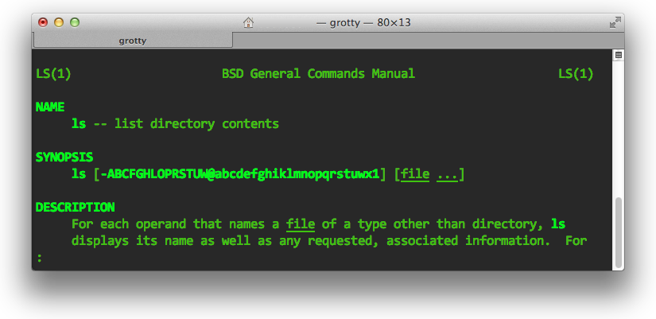

Online Manuals
**************
Most programs that can be launched from a terminal come with them a comprehensive form of online software documentation manual. These manuals can be easily accessed from the terminal directly by issuing the ``man`` command - short for manual. The ``man`` command should be supplied with the name of the program you wish to find out more about. For example, to discover more about the ``ls`` command, type ``man ls``. The prompt will disappear from the terminal, and you will be presented with documentation for ``ls``. Check out Figure :num:`fig-man` for a screenshot of the ``man`` program in operation.

.. _fig-man:

	
	The ``man`` program displaying the online manual for the ``ls`` command.

It's easy to navigate through documentation. The most straightforward way to do this is to use your up and down arrow keys to move up and down through the documentation respectively. Generally, the syntax of how to use the program is displayed at the top, with more in-depth discussion following after. To quit the manual and return to the prompt, simply push q on your keyboard.

.. note:: Although manual documentation is available on your computer, you can also access the manuals on the World Wide Web. Websites such as http://www.linuxmanpages.com provide manual pages for thousands of programs, all neatly categorised.

.. _requirements-installation-label:

you will be essentially creating a number of URL to view mappings. Views don't just have to return web pages. As you will see later on, they can return `JSON <http://en.wikipedia.org/wiki/JSON>`_/`XML <http://en.wikipedia.org/wiki/XML>`_ objects (useful for `AJAX requests <http://en.wikipedia.org/wiki/Ajax_(programming)>`_), or any other type of file you like (through the use of static files). More complex URL mappings that include forms of parameterisation can also be handled by Django - see `here <https://docs.djangoproject.com/en/1.5/topics/http/urls/>`_ for more information. *Creating clear, logical URL mappings is a hugely important aspect of developing a web application.*

In an attempt to make this concept easier to understand, Figure :num:`fig-relational-schema-basic-models` shows a relational schema representing the two models defined above.

.. _fig-relational-schema-basic-models:

.. figure:: ../images/relational-schema-basic-models.pdf
	:figclass: align-center

	A relational schema diagram which shows the two database tables created as a result of the Django models defined previously.
	
	
	However, there are external libraries which can perform such checks and sort out such changes, for example,

	`South <http://south.aeracode.org/>`_,. However, we don't discuss South in this tutorial. Have a look at the `official South tutorial <http://south.readthedocs.org/en/latest/tutorial/index.html>`_ if you'd like to learn more.
	
	
	Getting to grips with Django's Model-View-Template pattern is an important part of using the framework - and is often a stumbling block for many students. It can also be difficult to conform to the pattern if you have been developing in other frameworks or other tools, where you have had to do all the SQL grunt work yourself. However

	 These are stored within a Python list, demonstrated with the example taken from the Django shell below.

	.. code-block:: python

		>>> Category.objects.all()
		[<Category: home>, <Category: sport>, <Category: fun>]
		
		
		
LOGIN
-----

 Using Django's form functionality, user registration can be provided in the following steps.

#. First, a form should be created which maps to our ``User`` model - and if we create a secondary ``User`` model with additional fields, a form should be created to correspond to that, too.
#. We then create a view which corresponds to our one or two ``User`` form classes.
#. A template can be provided which helps describe how the forms should be displayed to the user.
#. A URL is then mapped to the view.

User logins also make use of forms - though the number details required is usually very small (only username and password). As such, we can create a simple HTML form within a login page template, without the need to use Django's form functionality.

#. Create a login view, ensuring that the view can process both HTTP ``GET`` and ``POST`` requests. For ``GET`` requests, the login form should be displayed to the user. For ``POST`` requests, the view should attempt to process login information provided by the user via the form.
#. Produce a template which displays a login form, containing a username and password input box. The form should also contain a login button to submit the form to the *same URL*, but using a HTTP ``POST`` request.
#. Map the login view to a URL.

TEMPLATES
---------

In most applications, there is often a lot of repetition in HTML markup. This isn't a particularly bad thing. Indeed, a well-designed website includes plenty of repetition, providing users of the site with a familiarity - as well as potentially making it easier for users to find what they are looking for. Most websites have repetitive page headers, navigation bars, sidebars and footers. In terms of code, there are often identical scripts which are added to each page. Repetitive navigation bars may require the same JavaScript and styling properties!

In essence, the identified HTML is the barebones for creating a blank HTML5 page. We identify the page as HTML5 with the ``<!DOCTYPE html>`` document type declaration - and set the title of the page to ``Rango`` like in all previous templates. Differences occur within the ``<body>`` of each page - so we have included only a HTML comment which we will replace in the next section. The ```` Django template command includes the ``static`` library, which will allow us to include any static media in our base template (or inheriting templates) with minimum hassle.

	We'll be replacing the comment with a Django template block - a portion of the template which can be `overridden by an inheriting template <https://docs.djangoproject.com/en/1.5/topics/templates/#id1>`_. We can replace the HTML comment we previously placed with a Django block. Let's call it ``body_block`` so we can clearly identify what it should contain. Our template should now look something like the code sample below.
	
	
	SESSIONS
	--------
	
	While a majority of data storage requirements will be satisfied through the use of Django's session framework, there `may be scenarios <http://wonko.com/post/why-you-probably-shouldnt-use-cookies-to-store-session-data>`_ where cookies would be a sensible approach. Before committing to cookies, examine the following considerations.
	
	
	exercises
	
	- Using cookies will only work with the cookie persists in the user's browser. A more permanent solution is to record the number of times the user visits and to store that in their UserPro

	The ``User`` object which corresponds to the currently logged in user can be accessed at ``request.user``, where ``request`` is a reference to the single required parameter for a view. Modify the existing ``UserProfile`` model you created so that it now includes an additional field to store the number of times a user has visited the website. The end result should mean the number of times each user has visited the site should now also be stored server-side. *Remember, you will need to recreate and synchronise your database!*
	
	
	
	
	
	.. note:: Most web APIs provide the ability to specify in what format results are returned to the requesting computer. For an example, `check out the documentation for the Echo Nest's API <http://developer.echonest.com/raw_tutorials/responses.html>`_. Note that the same data is returned in the two examples - the format in which the data is presented is the only difference.
	
	
	
	
	* Update the Index page to reflect the dynamic and changing content in Rango
		* List the most recently added Pages on the Index page
		* List the most viewed Pages on the Index page
	
	
		Dynamically Generating the Index page
		-------------------------------------

		To list the most recently added Pages and the most viewed Pages on the Index page you will need to:

			* Add a new field into the pages model to track when the page was added.
			* when a page is added the current date will need to be inserted
			* to be completed (tbc)
			
			
			
			
			
			
			Restricting add category/pages 
			...............................

			* Decorate the *add_page* and *add_category* views with the  @login_required decorator method.

				::

					@login_required
					def add_category(request):
						...

					@login_required	
					def add_page(request, category_name_url):
						...

			* Optionally, only show the "add new page" and "add new category" functionality to the user if the user is authenticated.
			* If you don't do this then users will be redirected to the login page (which is fine too).

				::

					
					<LI><A HREF="/rango/cat_add"> Add category</A></LI>
					

CSS

*style sheet language used for describing the presentation semantics of a document written in a markup language.* CSS therefore allows you to define the look and feel of your HTML documents, all while providing a neat separation of document presentation from the document markup itself. Such separation can be pretty handy for several reasons. Most notably, the separation of presentation and markup allows for one *stylesheet* to be used to style several HTML pages. This reduces the overall complexity of your implementation, and makes maintainability of the website easier - much like Django's template inheritance functionality. The separation can also improve the accessibility of your website. For example, different styling rules can be applied for people viewing on a smartphone than on a desktop computer.
			
			
			
			While this may be easy to understand, selectors can get a `whole lot more complex <http://learn.shayhowe.com/advanced-html-css/complex-selectors>`_.
			
			
			
			Experimenting
			-------------
			CSS can be a tricky thing to master at the best of times. Fortunately for you, there are many tools which you can make use of to make the development of your website easier. For example, `JSFiddle <http://jsfiddle.net>`_ allows you to add markup and CSS to a really cool web-based interface and observe the changes your CSS styles make as you progress. It's a great learning tool, and `we highly recommend trying it out <http://jsfiddle.net/8fPgT/>`_ to see what it can do for you. As a basic guide, enter markup into the top-left box, enter CSS into the top-right box, and click *Run* to see what the output is in the bottom-right.

			.. note:: We'll be using some JSFiddles as we work through different parts of the CSS tutorial. You can load them up and experiment by modifying the CSS styles to see what your changes do to the resultant output.

			

			* Update the "like" functionality so that the application keeps track of what each user likes. i.e. you will have to add in another model to record whether the user likes a category.

			 	

		   		
					<ul class="nav nav-list"><li>Category List</li></ul>
			    	
		   		
				

