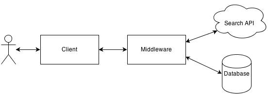

.. _overview-label:

Overview
========

The aim of this book is to provide you with a practical guide to web development in Django. The book is designed primarily for students providing a walk-through of the steps required in setting up your development environment and getting one of your first web applications up and running and finally deployed on a web server.

This book seeks to complement the official Django Tutorials, and many of the other excellent online tutorials. By putting everything together in one place, this book fills in many of the gaps in the official Django documentation providing an example based design driven approach to learning the Django framework. Furthermore, this book provides an introduction to many of the aspect required to master web application development. 

Why work with this book
-----------------------
**This book will save you time**. On many occasions we've seen clever students get stuck, spending hours trying to fight with Django and other aspect of web development, usually because a key piece of information was not provided or something was not clear. While the occasional blip might set you back 10-15 minutes, sometimes they can take hours to resolve. We've tried to remove as many of these hurdles as possible. This will mean you can get on with developing your application, and not figuring out another piece of the puzzle. 

**This book will lower the learning curve**. Web application frameworks can save you a lot of hassle and lot of time, well, that is, if you know how to use them! Often the learning curve is steep. This book tries to get you going, and going fast. By showing you how to put together a web application with all the bells and whistle from the onset, the book shortens this curve. 

**This book will improve your workflow**. Using web application frameworks requires you to pick up and run with a particular design pattern - so you only have to fill in certain pieces in certain places. After working with many students, we heard lots of complaints about using web application frameworks, about how they take control away from them (i.e. inversion of control).  To help you we've created a number of workflows to focus your development process so that you can regain that sense of control and build your web application in a discipline mannered.

**This book is not designed to be read**. Whatever you do, do not read this book! It is a hands-on guide to building web applications in Django, reading is not doing. To increase the value you gain from this experience, go through and develop the application. When you code up the application, do not just cut and paste the code. Type it in, think about what it does, then read the explanations we have provided to describe what is going on. If you still do not understand, then check out the Django documentation, go to stack overflow, etc and fill in this gap in your knowledge. If you think it is worth mentioning, please get in touch with us so that we can improve the book - we already have a number of contributors and we will happily acknowledge your contribution!

What you will learn
-------------------
In this book, we will be taking an exampled based approach (or inquiry based learning). The book will show you how to design a web application called **Rango** (see design brief below), and along the way show you how to:

	* Setup a development environment (using the terminal, Pip installer, working with Git, etc.)
	* Setup a Django project and create a basic Django application
	* Configure the Django project to use static media and other media files
	* Work with Django's Model - View - Template design pattern	
	* Create database models, use the object relational mapping functionality provided by Django, along with creating and use forms based on those models
	* Use the User Authentication services provided by Django
	* Incorporate external services into the application 
	* Include Cascading Styling Sheets (CSS) and Javascript within a web application
	* Design and apply CSS to improve the look and feel the web application
	* Work with cookies and sessions within views
	* Include more advanced functionality like AJAX into your application
	* Deploy your application to a web server using PythonAnywhere

At the end of each chapter, we have included a number of exercises designed to push you harder and to see if you can apply what you have learnt. The later chapters of the book provide a number of open development exercises along with coded solutions and explanations. Finally, all the code is available from GitHub:

https://github.com/leifos/tango_with_django

and to see a working version of the application you can visit the *How to Tango with Django* website:

http://www.tangowithdjango.com/rango/

Technologies and Services
-------------------------

Through the course of this book, we will used various technologies and external services, including:

	* Python, http://www.python.org
	* Pip, http://www.pip-installer.org
	* Django, https://www.djangoproject.com
	* Git, http://git-scm.com 
	* GitHub, https://github.com
	* HTML, http://www.w3.org/html/
	* CSS, http://www.w3.org/Style/CSS/
	* Javascript
	* JQuery, http://jquery.com
	* Twitter Bootstrap, http://getbootstrap.com/
	* Bing Search API via Azure Datamarket, http://datamarket.azure.com
	* PythonAnywhere, https://www.pythonanywhere.com

We've selected these technologies and services as they are either fundamental to web development and/or enable us to provide examples on how to integrate your web application with CSS toolkits (like Bootstrap), external services like (those provided by Azure) and deploy your application quickly and easily (with PythonAnywhere).

Rango: Initial Design and Specification
---------------------------------------

As previously mentioned the focus of this book will be to develop an application called **Rango**. As we develop this application, it will cover the core components that need to be developed when building any web application.

Design Brief
............
Your client would like you to create a website, called **Rango** that lets users browse through user defined categories to access various web pages. In Spanish, the word rango is used to mean "a league ranked by quality" or "position in a social hierarchy" (see https://www.vocabulary.com/dictionary/es/rango )

	* For the **main page** of the site, they would like visitors to be able to see:

	 	* the 5 most viewed pages
		* the five most rango'ed categories, and
		* some way for visitors to browse or search through categories.

	* When a user views a **category page**, they would like it to display:

		* the category name, the number of visits, the number of likes
		* along with the list of associated pages in that category (showing the page's title and linking to its url), and.
		* some search functionality (via Bing's Search API) to find other pages that can be linked to this category.
		
	* So for a particular category, they would like the name of the category to be recorded, the number of times each category page has been visited, and how many users have clicked a "like" button (i.e. the page gets rango'ed, and voted up the social hierarchy).
	
	* Each category should be accessible via a readable URL, for example, rango/books-about-django.
		
	* Only registered users will be able to search and add pages to categories. And so, visitors to the site should be able to register for an account.
	

The application seems, at first glance, reasonably straight forward. It is just a list of categories, linking to pages, right? However, there are a number of complexities and challenges that need to be addressed. First, let's try and build up a better picture of what needs to be developed by laying down some high level designs.

Exercises
---------
Before going any further think about these specifications and draw up the following design artefacts:

* N-Tier or System Architecture
* Wireframes of the Main Page and the Category Page
* The URL Mappings
* An Entity Relationship diagram to describe the data model

N-Tier Architecture
-------------------
The high level architecture for most web applications is an 3-Tier architecture. Rango will be a variant on this architecture as it interfaces with an external service.

Since we are building a web application with Django, we will use the following technologies:

	* The **Client** will be a web browser (i.e Chrome, Firefox, Safari, etc.) which will render HTML/CSS pages.
	* The **Middleware** will be a Django application (and be dispatched through Django's built in development web server while we develop the application).
	* The **Database** will be the Python based SQLite3 Database server.
	* The **Search API** will be the Bing Search API.

For the most part, this book will focus on developing the middleware. Though it should be quite evident from the diagram that we will have to interface with all the other components.

Wireframes
----------
Wireframes are great way to provide clients with some idea of what the application should look like when complete. They save a lot of time and can vary from hand drawn sketches to exact mock ups depending on the tools that you have available. For Rango, we'd like to make the site look something like these screen shots:

.. image:: ../images/wireframe_default.pdf

.. image:: ../images/wireframe_cat.pdf

TODO(leifos): add in annotations to the screenshots describing the functionality

Pages and URL Mappings
----------------------
From the specification we have already identified two pages that our application will present to the user at different points in time. To access each of these pages we will need to describe in some fashion the URL mappings - that is what the URL string will be that will activate this page (later referred to as View).

	* rango/ will point to the main (or index) page view
	* rango/about/ will point to an about page view
	* rango/cat/<category_name>/ will point to the category page view for <category_name>, where the category might be:
		* games 
		* python recipes
		* code and compilers
	* rango/etc 
	
As we build our application we will probably need to create other URL mappings, but these ones will get us started. Also, at some point we will have to transform the category names in a valid URL string, as well as handle when the category does not exist. 

As we progress through the book, we will flesh out how to construct these pages/view using the Django framework and its Model-View-Template design pattern. But, now that we have a gist of the URL mappings and what the pages are going to look like, we need to define the data model that will house the data for our web application. 

Entity-Relationship Diagram
---------------------------
Given the specification, it should be clear that, we have at least two entities: category and page, and that a category houses many pages. So we can formulate the following ER Diagram to describe the data model. 

.. image:: ../images/rango-erd.png

Note that the specification is vague. One page may be in one or many categories. So we could model the relationship as a many-to-many. However, this introduces a number of complexities, so we will make the simplifying assumption that one category contains many pages, but one page is assigned to one category. This does not preclude that the same page can be assigned to different categories (but the page would have to be entered twice, which may not be ideal). It good to note down any working assumptions like this, because you never know when they may come back to haunt you. By noting it down means you can communicate it with your development team and make sure that it sensible or that they are happy to proceed under such an assumption.

The resulting tables are shown below, where *Str* denotes a string or char field, *Int* denotes an integer field, *URL* denotes a URL field and FK denotes a Foreign Key.

**Category**

+------------+------+
| Field      | Type |
+============+======+
| name       | Str  |
+------------+------+
| views      | Int  |
+------------+------+
| likes      | Int  |
+------------+------+

**Page**

+------------+------+
| Field      | Type |
+============+======+
| category   | FK   |
+------------+------+
| title      | Str  |
+------------+------+
| url        | URL  |
+------------+------+
| views      | int  |
+------------+------+

We will also have a User table - which we have not shown here, but shall introduce later in the book. In the following chapters will we see how to instantiate these data models in Django and how to use Django's Object Relational Mapping to connect to the database. 

Summary
-------

These high level design and specifications will serve as a useful reference point when building our web application. While we will be focusing on using specific technologies these steps are common to most database driven web sites, so it is good idea to become familiar with and comfortable producing such specifications and designs.

If you already have Python 2.7.5 and Django 1.5.4 installed, you have a good working knowledge of the command line, configured your paths, then you can skip straight to the :ref:`Django Basics <django-basics>` chapter, otherwise, continue going through the setup stages.

Working with the Official Django Tutorials
..........................................

In the table below we suggest undertaking the Tutorials as part of the exercises associated with the chapters below in order to re-enforce your understanding of the framework and to build up your skills.

+--------------------+--------------------------+
| Tango With Django  | Official Django Tutorial |
+====================+==========================+
| Chapter 3          | Part 1 - Models          |
+--------------------+--------------------------+
| Chapter 5          | Part 2 - Admin           |
+--------------------+--------------------------+
| Chapter 6          | Part 3 - URLS and Views  |
+--------------------+--------------------------+
| Chapter 7          | Part 4 - Templates       |
+--------------------+--------------------------+
| Chapter 18         | Part 5 - Testing         |
+--------------------+--------------------------+
| Chapter 11         | Part 6 - CSS             |
+--------------------+--------------------------+

